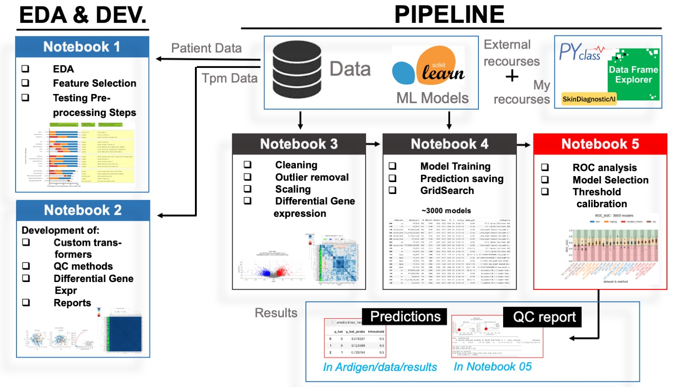
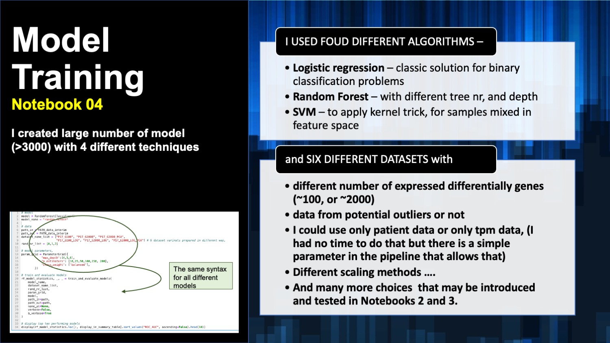
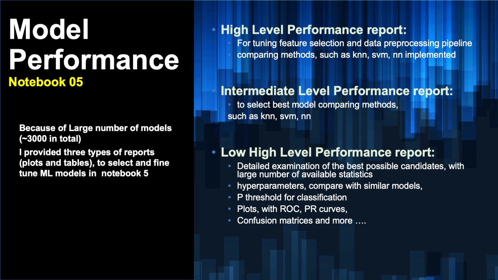
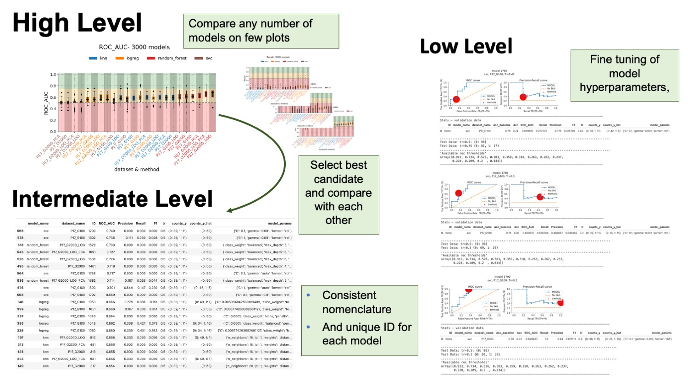
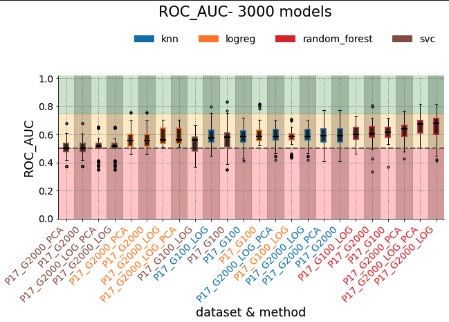
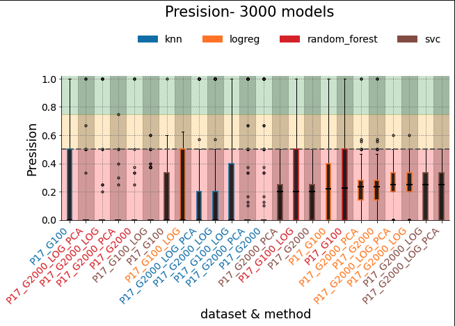
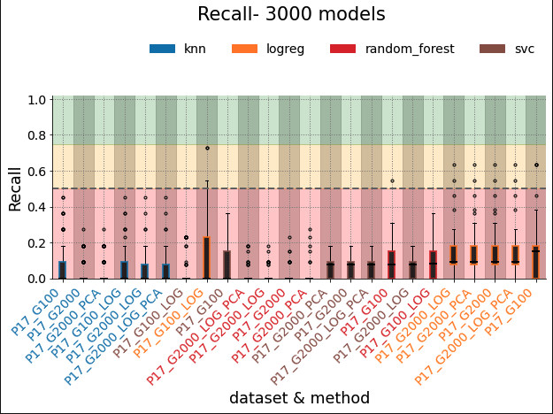
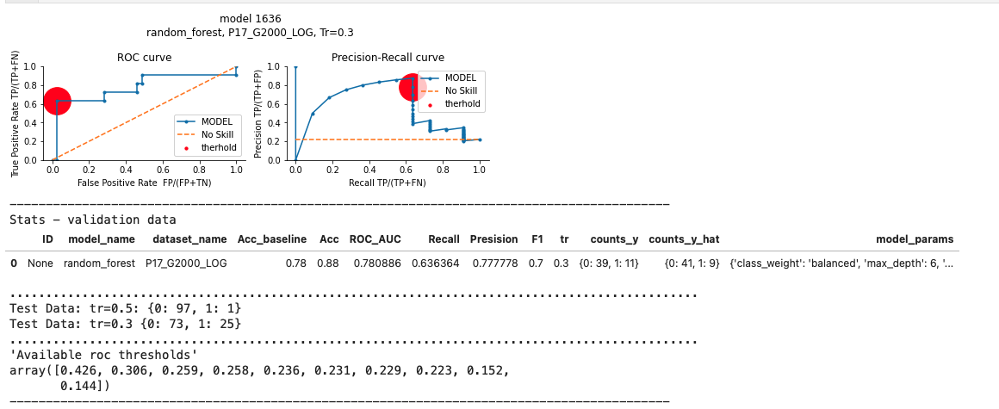

# Immunotherapy Response Prediciton
Author: Pawel Rosikiewicz, 2022.06.13 
Site: www.SimpleAI.ch

---

## PIPELINE ORGANIZATION
---

## KEY FEATURES
---

## PROJECT DESCRIPTION
---

### __GENERAL COMMENTS__  
In total I evaluated over 2500 ML models, on 6 different datasets, created from different data preparaiton pipelines, in this section i Created automated function that allow trainign, and evaluation of many different ML models, with diffferent datasets, hyper-parameters, and
piepline

 

### __METHODS__

__MODELS__  
To test how does this piepline work, I used the following methods:
* __k-nn__; that shoudl work well with low dimensionality data,
* __random forest__; I evaluated models with different number of classifiers, and depth,
__logistic regression__, that is a typical off-the shelf tool for binary classyficaiton
__suport vector classifier__, where I applied rbf kernel and compared it to linear one,

 

__HOW?__  
All models were run using the same pipeline, train_and_evaluate_models(), that returns,
* __model predictions__, 
* __statistics__, such as ROC AUC, acc, precision, recall, F1 etc... for every model
parameters; to allow retrainign the model, with the same set of parameters, eg on more data,
* __qc files for each patient__
* __qc files on each RNAseq data__
* __qc data on each gene selected, or rejected form the analysis__

 

__COLLECTED DATA__
With that information, I am able to eg:
* select the "best performing model"
* recalibrate threshold applied when classifiying samples wiht prepict_proba (see Notebook 05)
* perform error analyis, with stratyfication, and model comparison (future development)

 

__BASELINE__
* most frequent baseline, because we have two classes, and with 3/4 examples form one class, this will be difficult to improve with most models, usnig "inaproprietly" or badly prepared data

 

__IMPORTANT__; My pipeline, allows createing any number of train/validation dataset combinations, Ideally I woudl create several of these datsets, and evaluate each model on all of them, and performing stratified cross-validation. 
* Here I used only 3 combinations of train/test data, because of lack of time 
* the pipeline provides all the possibilities for that.
  
 

### ___RESULTS__

__BIG PICTURE - HIGH LEVEL PATTERNS OBSERVED IN THE RESULTS__  
Models created wiht my pipeline were compared using "ROC_AUC", "Presision", "Recall", to see what combinaiton of data preprocessing and models was able to generate the best models, on validations data
 
* Overall, the best performing model, were build with random forest algorithm, however these models, often sufferred with low precision and reacall, for less freqent class (1)
it is better to use larger number of genes, for making predicitons even if they eg models created wiht G2000 dataset, had consistenly higher ROC-auc then the models trains with G100, that contains from 885-150 differentially expressed genes,
* Interestingly, two datasets that generated the largest number of models with the highest values of ROC-AUC were treated very differently,
P17_G2000_PCA, had only 150 features, with PCA done on scaled log(tpm) data
in contrast, P17_G2000_LOG, had over 2500 features, with log(tpm) data,
* Suggestion: I woould compare results provided with these two models, and if they are consistent, between reach other I wodul preffer using the model with smaller number of features for deployment, even if additional genes were providing noise to the data,

__BEST PERFORMING MODEL__  

__The model__
* despite svm model ID 1790 had the highest ROC-AUC, the other model build with random forest alg. provides better treadoff in detecting good responders to treatment, (SEE NOTEBOOK 5 for more infromation, and tables)
* from that reason, I will use model with ID 1636 to provide predictions on test data

__Threshold adjustment__
* after testing sever different thresholds, I found tr=0.3, as providing the best tread-off between Specificity and Sensitivity,
* below you can see QC report

__QC report for the model provided with my pipeline__

__FUTURE IMPROVEMENTS__
* perfomr full error analysis, 
* stratyfied VC with potential confounder, such as sex, or smoking status/history
* I woudl like to add synthetic data:
  * eg. by adding noise, such as missign data,
feature exchange between samples, that clustered differently in error analysis
  * or to use completely synthetic data, created from average profiles in each strata and random noise

